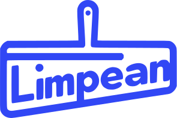

<h2>Description:</h2>
 <h3>
 A plataforma Limpean foi criada com o objetivo de suprir a lacuna tecnológica no setor de serviços de limpeza, abrangendo tanto o ambiente da Web quanto o Mobile. Dessa forma, nossa plataforma atua como intermediária entre os profissionais de limpeza e os contratantes, oferecendo a possibilidade de personalização dos serviços solicitados, o cadastro de mais de uma residência, o pagamento através da plataforma, chat, e um token para a inicialização do serviço. Isso garante a verificação da idoneidade e uma definição de preço flexível.
 </h3>

<h2>Plataforms:</h2>
  

<h2>Tools:</h2>
  

<h2>IDE's:</h2>
  

